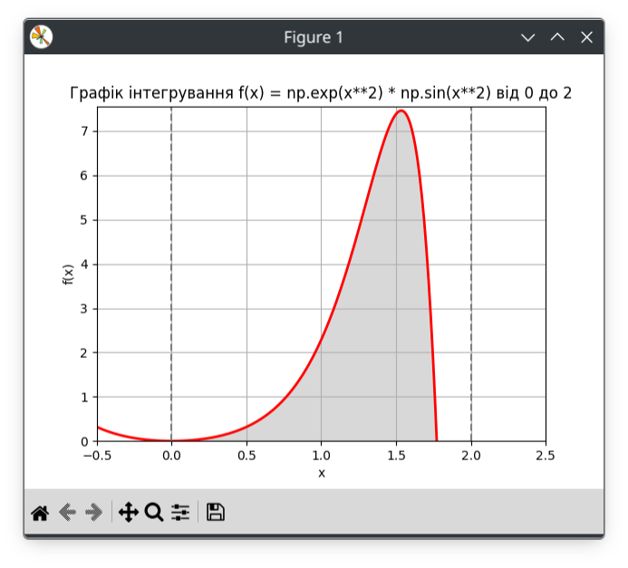

# goit-algo-hw-10
## Лінійне програмування та рандомізовані алгоритми

### Завдання 2
Оскільки завдання передбачало знаходження інтегралу чисельним стохастичним методом, я вибрав функцію, яка складно піддається інтегруванню, а саме `e**(x**2) * sin(x**2)`
Графік цієї функції виглядає так:

Як видно на графіку, прямокутник утворений відрізком інтегрування, має розміри приблизно 2 на 7, а площа під графіком покриває приблизно його третину. Тобто ми можемо очікувати на значення інтегралу ~ 4.7.
Співрозмірне значення було отримане методом Монте-Карло, однак quad повернув значення близько 0.79. Для додаткової перевірки я розрахував інтеграл методом Сімпсона і символьним методом. 
```
Інтеграл за допомогою quad: 0.7923207245801981
Інтеграл за методом Сімпсона: 0.7923207237698591
Інтеграл, розрахований символьним методом: 0.7923207245802 - 0.28518527799579*I
Середня площа фігури за 10 експериментів: 4.509019799967975
```
Як бачимо, чисельні методи інтегрування quad та Сімпсона повертають результат, що ігнорує уявну складову комплексного числа і чисельно відрізняється від площі шуканої фігури. Символьний метод дає істинний комплексний результат, але не дає уявлення про площу фігури. Метод Монте-Карло повертає результат, що відповідає приблизній площі фігури, але не говорить нічого про комплексну природу інтегралу.

Для того щоб переконатись що різниця в результатах пов'язана з комплексною природою інтегралу конкретної функції, а не з недосконалістю кода, я перевірив його на простішій функції `f(x) = sin(x)`
```
Інтеграл за допомогою quad: 1.4161468365471424
Інтеграл за методом Сімпсона: 1.416146836547546
Середня площа фігури за 10 експериментів: 1.4182266666662344
```
Всі три чисельних методи дали співрозмірний результат (символьний метод не перевірявся, бо там захардкожений вираз).
